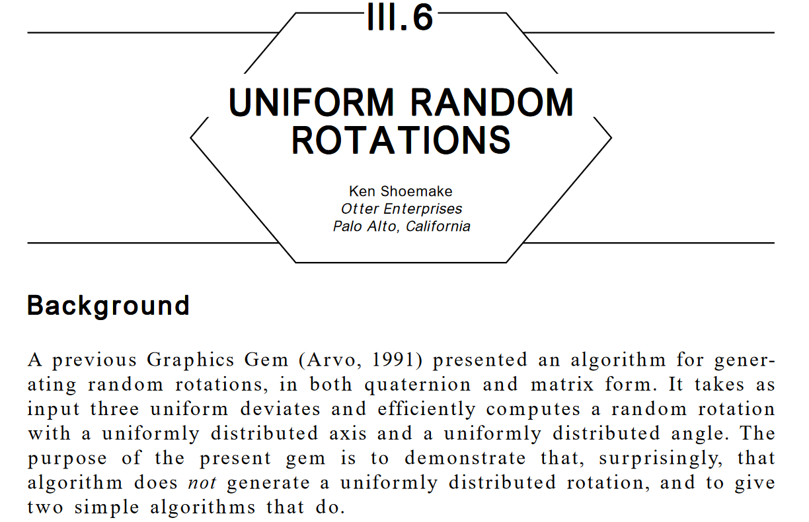

+++
title = "Testing out ChatGPT's coding abilities"
date = 2023-01-09
draft = true
categories = ["chatgpt", "artificial intelligence", "machine learning"]
removeBlur = false
plotly = true

[[images]]
 src = "/blog/chatgpt-bad-code/featured.png"
 alt = "chat gpt code snippet"
 stretch = true
+++

Last November OpenAI introduced a chatbot called ChatGPT built ontop of their GPT-3 language models.  Since this release it has gotten significant news coverage talking about its ability to help write essays, or even help program.  In this post we will take it for a test drive (a test conversation I suppose), with a few examples from code generation, to recipes, to discussing science.  These examples will focus mostly on single prompts to generate text, rather than using ChatGPT as a conversation engine.

<!--more-->

TODO:
Continue introductory text, maybe stackoverflow banning it, and some other links and discussion.

### Example:  Code Generation

The example I choose to focus on here is to get ChatGPT to generate me python code for a random quaternion.  Quaternions are commonly used in computing to describe orientations and rotations of objects in 3D space as they can be used to represent any member of the 3D rotation group $SO(3)$.

To generate code snippets, I give chatGPT the prompt "python code to generate a random quaternion".  Asking the same snippet is not deterministic:  you may get functionally different code snippets when repeatedly asking the same prompt.  Several of these different methods are collected here.  Through the post I'll refer to these alphabetically.

The most common response given by chatGPT is:

```python
# Method A (this comment by author, code below by chatGPT)
import random
import numpy as np

def random_quaternion():

    # Generate a random unit quaternion
    x0 = random.random()
    x1 = random.random()
    x2 = random.random()
    x3 = random.random()

    r = np.sqrt(x0*x0 + x1*x1 + x2*x2 + x3*x3)
    return [x0/r, x1/r, x2/r, x3/r]
```

At first glance method A is generating random numbers, and using it to generate a four-component normalized vector.  This does at least generate a valid quaternion from random numbers.  The question still remains as to whether this a random rotation.

```python
# Method B (this comment by author, code below by chatGPT)
import random
import numpy as np

def random_quaternion():
    # Generate random numbers for the quaternion values
    q = [random.uniform(-1, 1) for i in range(4)]
    # Normalize the quaternion
    return q / np.linalg.norm(q)
```

In B, we see another normalized 4-component vector, but now the components can be positive or negative, whereas in A all components are nonnegative.  Assuming these are valid this means that there are now significantly more possibilities for the return values of method B than in A.

```python
# Method C (this comment by author, code below by chatGPT)
def random_quaternion():
    # Generate three independent random variables from the standard normal distribution
    xi1, xi2, xi3 = np.random.normal(size=3)

    # Compute the remaining component of the quaternion
    q0 = np.sqrt(1 - xi1**2 - xi2**2 - xi3**2)

    # Return the quaternion as a NumPy array
    return np.array([q0, xi1, xi2, xi3])
```

Here in C three normally distributed random variables are generated, and the normalized property of quaternions is used to compute the fourth.  This one to me sounds promising.  One might suspect that this is also not going to give a distribution identical to B which is for sure not identical to A.


```python
# Method D (this comment by author, code below by chatGPT)
import random
import math

def random_quaternion():
    x1 = random.uniform(0, 1)
    x2 = random.uniform(0, 1)
    x3 = random.uniform(0, 1)
    r1 = math.sqrt(1 - x1)
    r2 = math.sqrt(x1)
    t1 = 2 * math.pi * x2
    t2 = 2 * math.pi * x3
    return (math.sin(t1) * r1, math.cos(t1) * r1, math.sin(t2) * r2, math.cos(t2) * r2)
```

In method D the code is more complicated, three numbers are used, and then transformed.
ChatGPT does not provide a useful explanation as to how or why this method works.
In one of the few runs giving this code snippet we do get a citation for Arvo 1991; however, this citation unfortunately is incorrect.
I've used this method before during my PhD work to make random orientations of particles as inputs to simulations - this method probably should attribute Ken Shoemake in Graphic Gems 3 chapter III, section 6 "Uniform Random Rotations" (book edited/compiled by David Kirk).  I pulled up a copy of this work as I recall it described how/why this method worked and it turns out the section opens that a previous edition of the graphics gem series published an erroneous method for random quaternions:

> {{ width = 80% }}

I suppose it is important to briefly mention what we would want in a random quaterion - that is we want one that describes a uniformly random rotation, or a random element of $SO3$.  For a random rotation $X$, for any arbitrary initial rotation $R$ we would want the distributions of the applied rotations $RX$ to equal $XR$ to also equal $X$.  In Shoemake's discussion this can be generated from uniform random points on the 4-dimensional hypersphere $S4$ (before he gives a complex to the more computationally efficient, but complicated example above).  One way to get a uniform point on S4 is to normalize a vector of 4 random normally distributed values (the multivariate normal distribution is spherically symmetric). This sounds similar to method C, but I was unable in a few dozen runs to get a snippet for this, so I suppose I have to write it.

```python
# Method E - code by author (newmanrs)
import numpy as np
def method_E():
    q = np.random.normal(size=(4,))
    return q / np.linalg.norm(q)
```

We can then look briefly at the validity of these methods.  Method A draws four values randomly from a unit hypercube, giving quaternions whose components whose expectation value will each be $\frac{\sqrt{3}}{4}$ (this follows from the expectation values of uniform x being $E(x)=\frac{1}{2}$ and of uniform $E(x^2)=\frac{1}{3}$).  Probably even attempting this math is overkill - this method can't generate quaternions with negative components so it is wrong.

Method C crashes whenever the squared sum of the three random numbers are greater than 1.  So also wrong.

That leaves methods B,D, and E as candidates.  These all have an expectation value of 0 when averaging over several quaternions.  The problem with B lies in projecting the volume of of a 4D hypercube onto the sphere gives higher densities at the corners (as opposed to E which is symmetric).

D and E give the same outputs (although one might question the numerical stability of E).  Find Graphics Gems III for those who want the proof).  Generating random quaternions and converting them to Euler angles should also reveal differences between these methods.

The main gist here is ChatGPT is definitely not a reliable source of knowledge for code generation.  It still requires the end user to have enough knowledge to vet it.  Some of the flawed methods are suggested by users on [stack overflow](https://stackoverflow.com/a/31604834).  Of course, ChatGPT does not give us context of other answers (or upvotes/comments explaining the flaws).


### Example:  Cooking Recipes

Can we generate sane recipes using ChatGPT?

> Recipe for thai red curry

>> Ingredients:<br>
1 can of coconut milk<br>
2-3 tablespoons of red curry paste<br>
1 pound of protein (chicken, beef, shrimp, or tofu)<br>
1 cup of vegetables (bell peppers, eggplant, bamboo shoots, or green beans)<br>
1 tablespoon of fish sauce<br>
1 tablespoon of brown sugar<br>
1 tablespoon of vegetable oil<br>
Fresh basil or cilantro for garnish<br>
Instructions:<br>
Heat the oil in a pan or wok over medium-high heat.<br>
Add the curry paste and stir-fry for 1-2 minutes until fragrant.<br>
Add the protein and stir-fry for an additional 2-3 minutes until cooked through.<br>
Add the vegetables and continue stir-frying for 2-3 minutes until they are slightly softened.<br>
Pour in the coconut milk, fish sauce, and brown sugar. Bring the mixture to a simmer.<br>
Reduce the heat to low and let the curry simmer for 10-15 minutes until the sauce thickens.<br>
Taste and adjust seasoning if necessary.<br>
Garnish with fresh basil or cilantro and serve over rice.<br>
Enjoy!<br>

This is reasonably the most typical generic Thai curry recipe I would find on the Internet.  Isn't a great one, but probably about what I would expect if I blindly picked a red curry recipe from an English-language recipe aggregator.

### Example:  Advanced topics in Science and Engineering

It seems in certain niches the algorithm performs remarkably well.

> Explain the variational principle in quantum mechanics


>> "The variational principle in quantum mechanics is a method for approximating the ground state energy of a quantum mechanical system. It states that the ground state energy of a quantum mechanical system is the lowest possible energy that the system can have. The principle can be used to find approximate solutions for the wave function and energy of a system, by assuming a trial wave function and then varying its parameters to minimize the expectation value of the Hamiltonian operator for that wave function. <br>
The basic idea behind the variational principle is that any trial wave function, no matter how inaccurate, will provide an upper bound for the true ground state energy of the system. This is because the expectation value of the Hamiltonian operator for the trial wave function is greater than or equal to the true ground state energy. By minimizing the expectation value of the Hamiltonian operator for a trial wave function, we can obtain an approximation for the true ground state energy of the system. <br>
The Variational principle is useful in many-body systems and in fields like quantum chemistry, where the exact solutions for the wave function and energy of a system can be difficult or impossible to obtain. The variational principle can be used to approximate the ground state energy of a system, as well as the excited state energies and wave functions."

This is a fantastic explanation.  This is absolutely far better than the introduction [currently on wikipedia](https://en.wikipedia.org/w/index.php?title=Variational_method_(quantum_mechanics)&oldid=1124842517).  For a more opinioned, borderlining egostistical introduction (but still in a fun way), seek out an "Introduction to Quantum Mechanics" by David Griffiths:

> "Suppose you want to calculate the ground state energy, $E_{gs}$, for a system described by the Hamiltonian $H$, but you are unable to solve the (time-independent) Schrödinger equation. The <b>variational principle</b> will get you an upper bound for $E_{gs}$, which is sometimes all you need, and often, if you're clever about it, very close to the exact value.  Here's how it works: Pick any normalized function $\psi$ whatsoever; I claim that
$$ E_{gs} \leq \langle \psi | H | \psi \rangle  \equiv \langle H  \rangle$$

Above is taken from the second edition.  For the math inclined, this is because the energy levels correspond to eigenfunctions of the system, of which the ground state is by definition lowest.  Any incorrect function $\psi$ can be expressed as a linear combination of the eigenfunctions of $H$, with corresponding higher average energy.

I will explain the point of this diversion after a few more examples in the closing remarks.

### ChatGPT is surprisingly good at poetry

I don't know about you, but I feel the tech world needs more poetry and apparently ChatGPT can fill this niche.

> discuss the python global interpreter lock as poetry

>> The GIL doth guard the Python interpreter,<br>
A lock that doth control the flow,<br>
Of bytecode execution,<br>
For all threads to know.<br>
<br>
It doth protect the memory,<br>
From concurrent access,<br>
But doth also limit,<br>
A CPU's true prowess.<br>
<br>
For only one thread at a time,<br>
Can run within the interpreter,<br>
Thus multi-threaded programs,<br>
May not be as faster.<br>
<br>
But fear not, for there are ways,<br>
To circumvent the GIL,<br>
By using subprocesses,<br>
Or C extensions to build.<br>
<br>
So let the GIL do its job,<br>
And keep the interpreter safe,<br>
But for true concurrency,<br>
Other options we must embrace. <br>

I find this example fantastic as it does both deliver a poem and somehow a reasonable discussion of the pitfalls and nuisances of the GIL.  In fact, just recently a [PEP](https://peps.python.org/pep-0703/) was released discussing the need for and consequences of removing the GIL.

> thai red curry in the poetic style of the modern major general

>> I am the very model of a modern major general <br>
I've information vegetable, animal, and mineral <br>
I know the kings of England, and I quote the fights historical <br>
From Marathon to Waterloo, in order categorical <br>
 <br>
Thai red curry, a dish that I can make with ease <br>
I'll fry the curry paste with skill and then add some Thai basil leaves <br>
I'll toss in some meat, be it chicken or beef <br>
And then I'll add the vegetables that are oh so brief <br>
 <br>
I'll pour in the coconut milk and let it simmer with care <br>
And add fish sauce and lime for that Thai flair <br>
I'll garnish with cilantro, and serve it over rice <br>
A dish that's spicy and sweet, oh so very nice <br>
 <br>
In short, in matters vegetable, animal, and mineral <br>
I am the very model of a modern major general <br>
And a Thai chef, that's what I am, and nothing less, <br>
A master of all curry, and all the spices to impress. <br>

Here ChatGPT almost seems to get the forced-rhyme pairs.  And hey this time it figured out you should use Thai basil so perhaps this is better than the recipe it delivered above.

### Example: Generate me some boilerplate jargon

ChatGPT in my testing is remarkably proficient in generating jargon pages.  Herein I give ChatGPT two prompts to generate about pages for two different kinds of businesses: a third wave coffee shop, and a useless monthly subscription sales ["startup"](https://web.archive.org/web/20180823131751/https://www.drinkhint.com/add-subscription?offset=0&limit=100).

### Discussion and Closing Remarks

I suppose we should note that that ChatGPT was trained on a large scrape of the modern web (including wikipedia), archives of books, 
