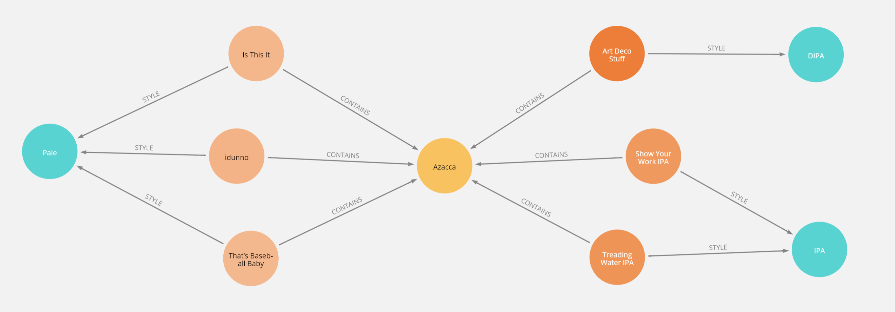

+++
title = "PAGE BUNDLE GALLERY TEST"
date = 2021-09-26
draft = true
categories = ["pagebundle"]
removeBlur = false

[[images]]
 src = "/blog/pagebundle/azacca.png"
 alt = "Cloudburst beers containing Azacca"
 stretch = true
+++

Testing functionality of pagebundles.

<!--more-->

# Hello

Hello

# Test image galleries

Gallery!

200px


100px


50px


Hello trying with different height




